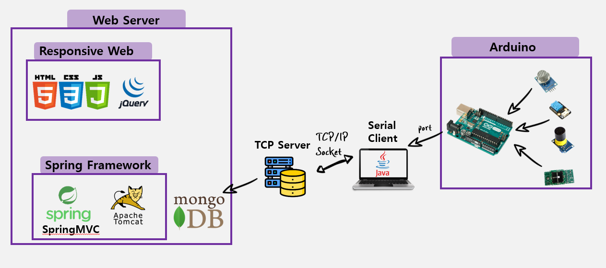

# DCS-Intern

## :bulb:Gas & FineDust Monitoring

데이터센터의 부식성 가스 및 미세먼지 모니터링

| 폴더명                           | 비고                                   |
| -------------------------------- | -------------------------------------- |
| [GasMonitoring](./GasMonitoring) | SpringMVC 모니터링                     |
| [TcpServer](./TcpServer)         | 아두이노와 Serial 통신하는 Client 서버 |
| [WebServer](./WebServer)         | TCP 서버                               |

### 시스템 아키텍처

